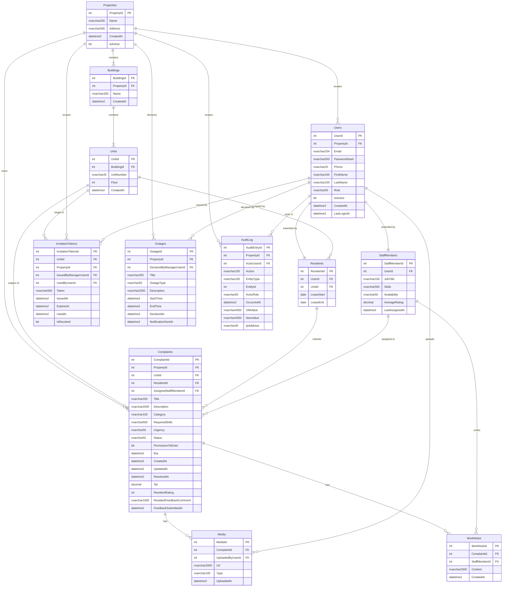
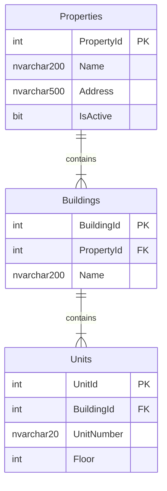
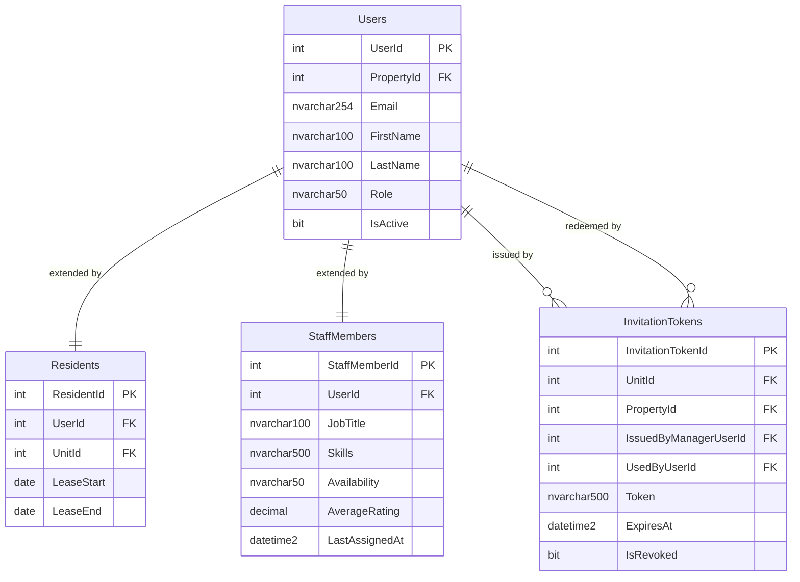
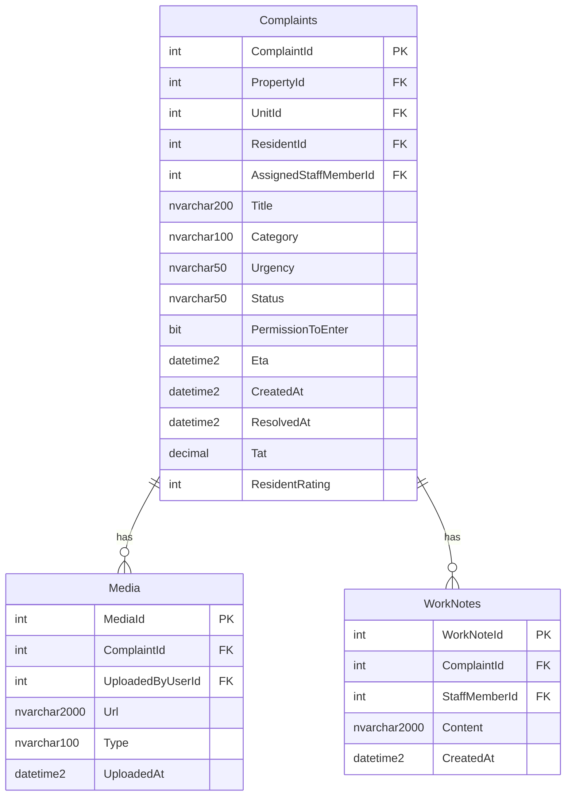
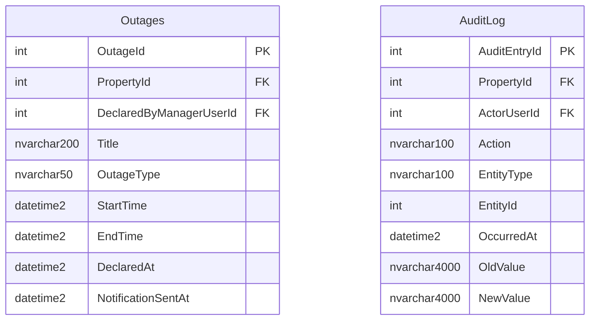

# Entity Relationship Diagram

**Document:** `docs/04_Data/schema/erd.md`  
**Version:** 1.0  
**Status:** Approved  
**Project:** Apartment Complaint Logging System (ACLS)

---

> [!IMPORTANT]
> This diagram is the authoritative visual representation of the ACLS database schema. It must remain in sync with `docs/04_Data/data_model_overview.md` at all times. If the two documents conflict, `data_model_overview.md` is the source of truth for field-level detail. This ERD is the source of truth for entity relationships and cardinality. When generating EF Core entity configurations or migrations, read both documents together.

---

## How to Read This Diagram

- `||--||` — exactly one to exactly one (one-to-one)
- `||--o{` — exactly one to zero or many (one-to-many, FK side is "many")
- `}o--||` — zero or many to exactly one
- `||--|{` — exactly one to one or many (one-to-many, mandatory children)

Relationship labels describe the action from left entity to right entity.

---

## Full Schema ERD



---

## Relationship Notes

### Users → Residents and Users → StaffMembers (One-to-One)

`Residents` and `StaffMembers` are extension tables of `Users`. A `User` with `Role = Resident` has exactly one corresponding row in `Residents`. A `User` with `Role = MaintenanceStaff` has exactly one corresponding row in `StaffMembers`. A `User` with `Role = Manager` has no extension table row.

In EF Core this is modelled as a one-to-one owned or referenced relationship:

```csharp
// In UserConfiguration.cs
builder.HasOne<Resident>()
       .WithOne()
       .HasForeignKey<Resident>(r => r.UserId)
       .OnDelete(DeleteBehavior.Restrict);

builder.HasOne<StaffMember>()
       .WithOne()
       .HasForeignKey<StaffMember>(s => s.UserId)
       .OnDelete(DeleteBehavior.Restrict);
```

### Complaints → StaffMembers (Nullable FK)

`Complaints.AssignedStaffMemberId` is nullable. A newly submitted complaint has `AssignedStaffMemberId = NULL` and `Status = OPEN`. The FK is populated atomically when a Manager assigns the complaint (and simultaneously sets `StaffMember.Availability = BUSY`).

```csharp
// In ComplaintConfiguration.cs
builder.HasOne<StaffMember>()
       .WithMany()
       .HasForeignKey(c => c.AssignedStaffMemberId)
       .IsRequired(false)
       .OnDelete(DeleteBehavior.Restrict);
```

### Media → Users (Upload Authorship)

`Media.UploadedByUserId` references `Users` directly — not `Residents` or `StaffMembers` — because both Residents (evidence photos at submission) and Staff (completion photos at resolution) upload media. The application layer distinguishes the upload context from the `User.Role` on the authenticated user.

### InvitationTokens → Users (Two FKs)

`InvitationTokens` has two FKs to `Users`:
- `IssuedByManagerUserId` — the Manager who created the token (NOT NULL)
- `UsedByUserId` — the Resident who redeemed it (NULL until used)

These are two distinct relationships and must be configured separately in EF Core with explicit foreign key names to avoid shadow property conflicts.

```csharp
// In InvitationTokenConfiguration.cs
builder.HasOne<User>()
       .WithMany()
       .HasForeignKey(t => t.IssuedByManagerUserId)
       .HasConstraintName("FK_InvitationTokens_IssuedByManager")
       .OnDelete(DeleteBehavior.Restrict);

builder.HasOne<User>()
       .WithMany()
       .HasForeignKey(t => t.UsedByUserId)
       .HasConstraintName("FK_InvitationTokens_UsedByResident")
       .IsRequired(false)
       .OnDelete(DeleteBehavior.Restrict);
```

### AuditLog → Properties and AuditLog → Users (Nullable FKs)

Both `AuditLog.PropertyId` and `AuditLog.ActorUserId` are nullable to accommodate system-initiated events (background jobs, automated notifications) that do not originate from a user request and may not be scoped to a single property.

### Outages → Users (Declared By)

`Outages.DeclaredByManagerUserId` references `Users` directly. The application layer enforces that only a user with `Role = Manager` can call the `DeclareOutage` endpoint. The FK constraint itself does not restrict by role.

---

## Sub-Diagrams by Bounded Context

These sub-diagrams isolate each bounded context for easier reading when working on a specific area.

---

### Property Hierarchy



---

### Identity and Users



---

### Complaints Core



---

### Outages and Audit



---

## Index Summary

Quick reference for all non-PK indexes defined across the schema. Use this when writing EF Core `HasIndex()` configurations.

| Table | Index columns | Type | Purpose |
|---|---|---|---|
| `Users` | `Email` | UNIQUE | Login lookup, uniqueness enforcement |
| `Users` | `PropertyId` | Standard | Tenant scoping |
| `Users` | `Role` | Standard | Role-based filtering |
| `Buildings` | `PropertyId` | Standard | Property hierarchy traversal |
| `Units` | `BuildingId` | Standard | Building children query |
| `Units` | (`BuildingId`, `UnitNumber`) | UNIQUE | Prevent duplicate unit numbers within a building |
| `Residents` | `UserId` | UNIQUE | One-to-one enforcement |
| `Residents` | `UnitId` | Standard | Unit occupancy lookup |
| `StaffMembers` | `UserId` | UNIQUE | One-to-one enforcement |
| `StaffMembers` | `Availability` | Filtered (`= 'AVAILABLE'`) | Dispatch query — available staff only |
| `Complaints` | `PropertyId` | Standard | Mandatory on every complaint query |
| `Complaints` | (`PropertyId`, `Status`) | Standard | Dashboard and triage queue |
| `Complaints` | (`PropertyId`, `AssignedStaffMemberId`) | Standard | Staff task list |
| `Complaints` | (`PropertyId`, `UnitId`) | Standard | Unit complaint history |
| `Complaints` | (`PropertyId`, `ResidentId`) | Standard | Resident complaint history |
| `Complaints` | `CreatedAt` | Standard | Date range filtering and sorting |
| `Media` | `ComplaintId` | Standard | Media by complaint |
| `WorkNotes` | `ComplaintId` | Standard | Notes by complaint |
| `InvitationTokens` | `Token` | UNIQUE | Token lookup at registration |
| `InvitationTokens` | `UnitId` | Standard | Tokens for a unit |
| `InvitationTokens` | `PropertyId` | Standard | Tenant scoping |
| `Outages` | `PropertyId` | Standard | Tenant scoping |
| `Outages` | (`PropertyId`, `StartTime`) | Standard | Active/upcoming outage queries |
| `AuditLog` | (`PropertyId`, `OccurredAt`) | Standard | Audit trail by property and time |
| `AuditLog` | (`EntityType`, `EntityId`) | Standard | Audit trail for a specific entity |
| `AuditLog` | `ActorUserId` | Standard | Actions by a specific user |

---

*End of Entity Relationship Diagram v1.0*
