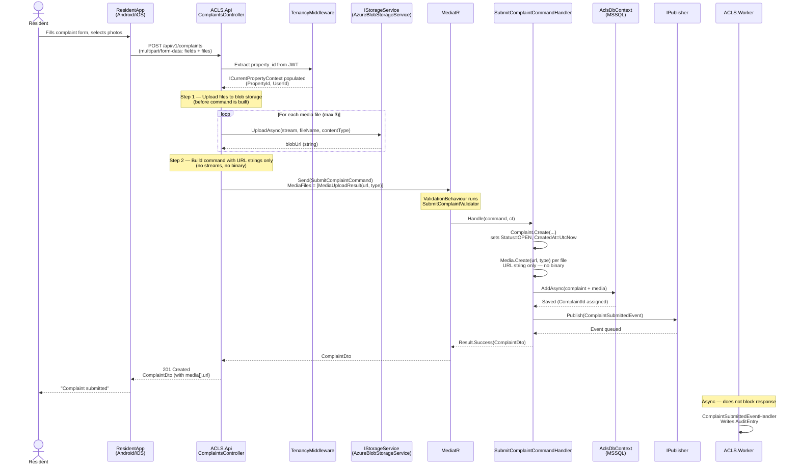
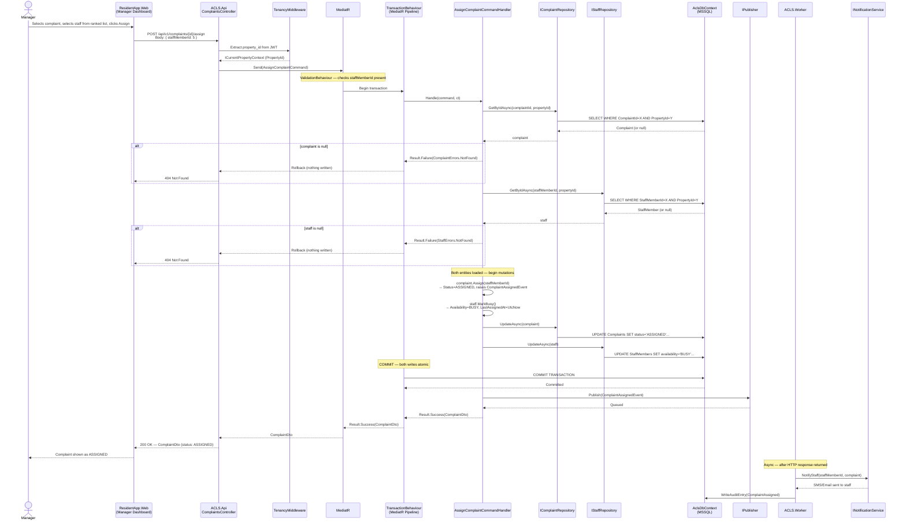
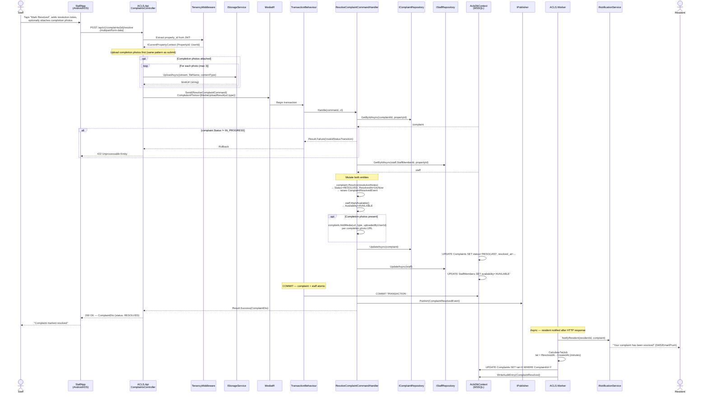
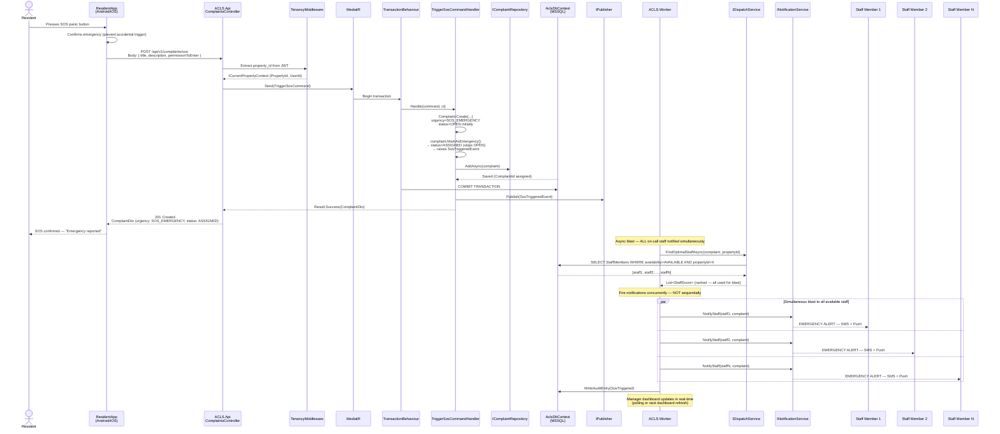
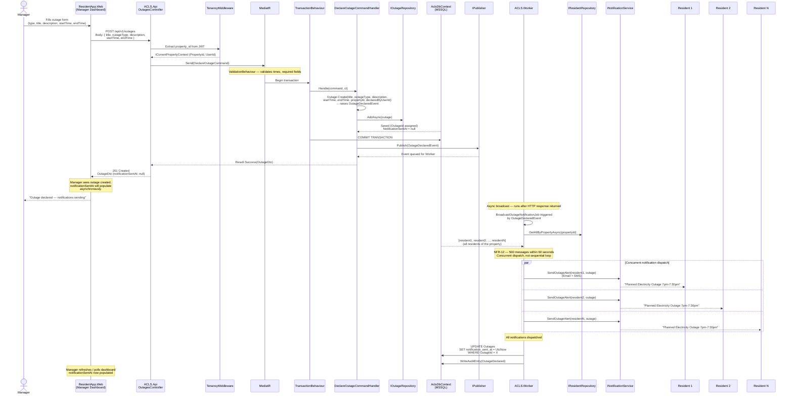

# Sequence Diagrams — ACLS Critical Workflows

**Document:** `docs/06_UML/sequence_diagrams.md`  
**Version:** 1.0  
**Status:** Approved  
**Project:** Apartment Complaint Logging System (ACLS)

---

> [!IMPORTANT]
> These sequence diagrams are the authoritative specification for the five most critical workflows in ACLS. Every step, every actor, every message, and every ordering shown here must be reflected exactly in the implementation. If the code diverges from a diagram, the code is wrong — not the diagram. Read the relevant diagram before implementing any of these workflows.

---

## Diagram Index

| # | Workflow | Triggered by | Key constraint |
|---|---|---|---|
| 1 | Submit Complaint (with media) | Resident | Blob upload before DB write |
| 2 | Assign Complaint | Manager | Atomic transaction — complaint + staff in one commit |
| 3 | Resolve Complaint | Maintenance Staff | Atomic transaction + async notification |
| 4 | SOS Emergency Trigger | Resident | Simultaneous blast to all on-call staff |
| 5 | Declare Outage | Manager | Async broadcast — must not block HTTP response |

---

## Diagram 1 — Submit Complaint (with Media)

**Trigger:** Resident submits a new complaint via `POST /api/v1/complaints` with multipart/form-data including up to 3 photo files.

**Key constraint:** Blob storage upload happens in the controller, before the command is dispatched. Binary content never reaches the Application or Domain layers. Only URL strings are passed in the command.

---

## Diagram 2 — Assign Complaint

**Trigger:** Manager assigns a complaint to a staff member via `POST /api/v1/complaints/{id}/assign`.

**Key constraint:** The complaint status change (`OPEN → ASSIGNED`) and the staff availability change (`AVAILABLE → BUSY`) must be committed in a single database transaction. If either write fails, both are rolled back. The system must never be in a state where a complaint is ASSIGNED but the staff member is still AVAILABLE.

---

## Diagram 3 — Resolve Complaint

**Trigger:** Maintenance Staff marks a complaint resolved via `POST /api/v1/complaints/{id}/resolve` with optional completion photos.

**Key constraint:** The complaint status (`→ RESOLVED`) and staff availability (`→ AVAILABLE`) are committed atomically. Resident notification happens asynchronously after the commit — it must not block the HTTP response. TAT calculation is also async.

---

## Diagram 4 — SOS Emergency Trigger

**Trigger:** Resident activates the SOS panic button via `POST /api/v1/complaints/sos`.

**Key constraint:** The SOS flow bypasses normal triage. All available on-call staff are notified simultaneously — not one-at-a-time, not waiting for manager action. The notification blast is concurrent. The complaint is immediately moved to ASSIGNED without manager intervention.

---

## Diagram 5 — Declare Outage (with Mass Broadcast)

**Trigger:** Manager declares a property-wide outage via `POST /api/v1/outages`.

**Key constraint:** The HTTP response must return immediately after the outage record is persisted. The mass notification broadcast to all residents is asynchronous and must not block the response. The broadcast must complete within 60 seconds for a property of 5,000 units (NFR-12). Notifications are dispatched concurrently, not sequentially.

---

## Cross-Cutting Notes

### Async Event Pattern

All five diagrams follow the same pattern for post-commit side effects:

1. The command handler publishes a domain event after the transaction commits.
2. The HTTP response is returned immediately after the event is published.
3. `ACLS.Worker` handles the event asynchronously.
4. Notifications, TAT calculations, and audit writes happen in the Worker — never inline in the handler.

This ensures the API response time is never held hostage by notification delivery speed, and that a slow SMS provider cannot cause an HTTP timeout.

### Transaction Boundary Rule

The transaction in Diagrams 2 and 3 spans exactly the two database writes that must be atomic:

| Diagram | Write 1 | Write 2 |
|---|---|---|
| Assign Complaint | `Complaints.Status = ASSIGNED` | `StaffMembers.Availability = BUSY` |
| Resolve Complaint | `Complaints.Status = RESOLVED` | `StaffMembers.Availability = AVAILABLE` |

The domain event publish (`Publisher.Publish(...)`) happens inside the handler but after both writes, before the transaction commits in Diagram 2 and after commit in Diagram 3. In both cases the event is only processed by the Worker if the transaction has committed — events are not processed for rolled-back transactions.

### 404 on Cross-Property Access

In Diagrams 2 and 3, the `GetByIdAsync` calls include `propertyId`. If the complaint or staff member belongs to a different property, the repository returns `null` and the handler returns `Result.Failure(NotFound)` — which maps to HTTP 404. The caller cannot determine whether the resource exists but is inaccessible (403) or simply does not exist (404). This is intentional — see `docs/07_Implementation/patterns/multi_tenancy_pattern.md` Section 7.

---

*End of Sequence Diagrams v1.0*
